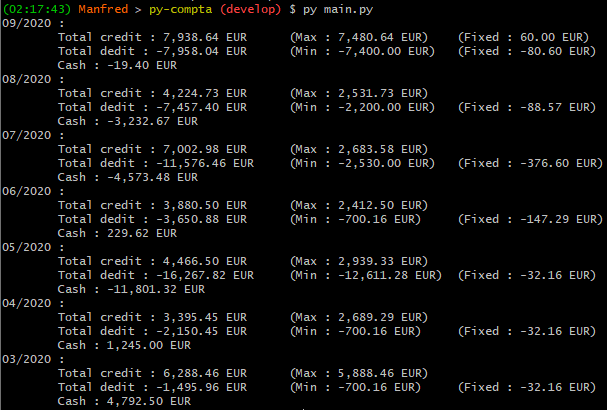

# :classical_building: Accounting 

Aim is to propose a simple algorithm that read, parse, store, process and display financial data for individuals :money_with_wings:.

## :tada: Examples



## :spiral_calendar: Dates

### :rocket: Version 2 Started 
Project pitched and started the _11th december 2020_

### :dart: Release date 
First expected release the friday **15th december 2020** 


## :electric_plug: Dependencies
1. Set your Virtual Environment:

    ``` bash
    # Download venv librairy
    apt-get install python3-venv -y
    # Create your venv
    py -m venv my_venv
    # Activate your venv
    . venv/bin/activate
    ```
    
    _For more information, go to [Python Virtual Environment Official Documentation](https://docs.python.org/3/library/venv.html)._

1. Install the project dependencies:

    ``` bash
    apt install python3-pip
    ```

## :clipboard: Tasks

1. Database
	- [ ] Create schema
	
1. Payments
	- [ ] Create account
	- [ ] Fake few payments
	- [ ] Expose data
	- [ ] Handle labels
		- [ ] Auto labeling on rules
		- [ ] Endpoint for labeling
	
1. Integration
	- [ ] Integrate excel data from Société Générale
	- [ ] Save data in database
		  
1. Statistics
	- [ ] Define profile
	- [ ] Get monthly stats (max, mix, avg, fix)
	- [ ] string similarity calculation to identify recurrent transactions 
	  
1. Front
	- [ ] Consumption map on a calendar just like github contribution calendar
