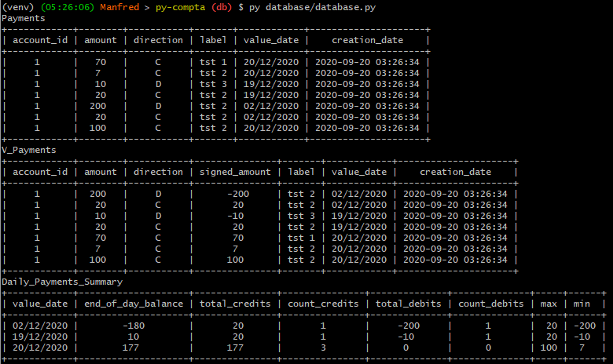

# :classical_building: Accounting 

Aim is to propose a simple algorithm that read, parse, store, process and display financial data for individuals :money_with_wings:.

## :tada: Examples


## :spiral_calendar: Dates

### :rocket: Version 2 Started 
Project pitched and started the _11th december 2020_

### :dart: Release date 
First expected release the friday **15th december 2020** 


## :electric_plug: Dependencies
1. Set your Virtual Environment:

    ``` bash
    # Download venv librairy
    apt-get install python3-venv -y
    # Create your venv
    py -m venv my_venv
    # Activate your venv
    . venv/bin/activate
    ```
    
    _For more information, go to [Python Virtual Environment Official Documentation](https://docs.python.org/3/library/venv.html)._

1. Install the project dependencies:

    ``` bash
    apt install python3-pip
    pip install PTable
    pip install Flask
    pip install extraction graphene flask-graphql requests
    ```

## :zap: Quick start

1. To start the backend server, simply run bellow commands:

	``` bash
		$ export FLASK_APP=controller.py
		$ export FLASK_ENV=development
		$ flask run
		 * Running on http://127.0.0.1:5000/
	```

## :clipboard: Tasks

1. Database
	- [x] Create schema
	- [ ] Try to use some DB framework
	
1. Payments
	- [x] Create account
	- [x] Fake few payments
	- [x] Compute few metrics
	  
1. REST API
	- [x] Expose data 
		- [x] Flask
		- [x] GraphQL ~> not very effective
	- [x] Design API (Postman ~> not effective)
	- [ ] Insert payments ?
	- [ ] Handle labels
		- [ ] Auto labeling on rules
		- [ ] Endpoint for labeling
		- [ ] Create categories and pattern that fall in this category
			- [ ] Courses
			- [ ] Amazon
		- [ ] Can 2 categories share same payments ?
			- [ ] Need exclusive categories for global expenses pie-chart
			- [ ] and non-exclusive categories for relative expenses pie-chart
	
1. Integration
	- [x] CSV from Societe Generale
	  - [x] Get all files in directory
	  - [x] read each file, one after the other
	  - [x] Parser rows and map to RawPayments
	- [ ] Save in database
		- [ ] If file is duplicate => skip
	- [ ] View all payments and duplications between files (count same lines in file and across files)
	- [ ] CSV from N26

1. Statistics
	- [ ] Define profile
	- [ ] Get monthly stats (max, mix, avg, fix)
	- [ ] Get period stats (day, week, month, semester, year)
	- [ ] string similarity calculation to identify recurrent transactions 
	  
1. Front
	- [ ] Consumption map on a calendar just like github contribution calendar


## :joystick: More examples

### :floppy_disk: Database example 

